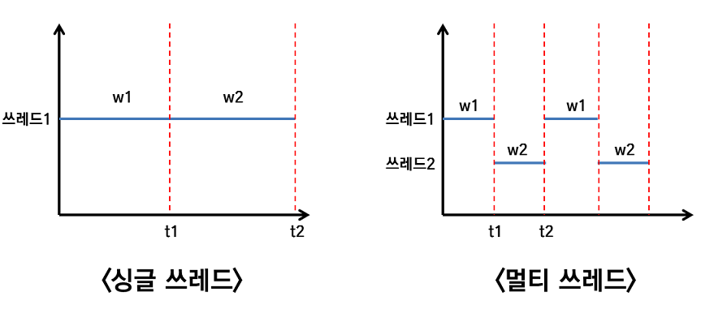

# 12장 쓰레드(Thread)
## 1. 프로세스와 쓰레드

#### * 프로세스 (일터)
     실행중인 프로그램  
     프로그램을 수행하는데 필요한 데이터, 메모리등의 자원+쓰레드로 구성되어있음.
     
     최소 하나 이상의 쓰레드가 존재함. (둘 이상 = 멀티 쓰레드)

#### * 쓰레드 (일꾼)
     개별적인 메모리공간(호출스택) 필요
     
     ∴ 프로세스의 메모리(호출스택) 한계에 따라 쓰레드 수 결정됨.

- 실제로는 한개의 CPU가 한번에 한가지 작업만 수행이 가능함.

    ∴프로세스의 성능과 쓰레드 수는 비례하지 않으며 오히려 낮은 경우도 있다.

#### * 멀티쓰레딩의 장점
1. CPU 사용률 향상
2. 자원 사용이 효율적
3. 사용자에 대한 응답성 햫상
4. 작업을 분리하므로 코드가 간결해짐

#### * 멀티쓰레딩의 단점
1. 동기화
2. 교착상태 (두 쓰레드가 자원을 점유한 상태에서 서로 상대편이 점유한 자원을 사용하려고 기다리는 상태.)

## 2. 쓰레드 구현법
1. 쓰레드 클래스 상속 (extends Thread)
    - 다른 클래스를 상속받을 수 없음. 
2. Runable 인터페이스 구현 (Implements Ruable)
    - 일반적인 방법
    - 재사용성이 높고 코드의 일관성을 유지할 수 있음.
    - run() 메소드만 정의되어 있음. (구현 필요)

## 3. start()와 run()
쓰레드를 실행시키는 방법 = start()호출 (run()호출이 아님!)

#### * run()호출
    단순히 클래스에 속한 메소를 호출하는 것
#### * start()호출
    새로운 쓰레드가 작업을 실행하는데 필요한 호출스택을 생성한 후 run()을 호출해 생성된 호출스택에 run()이 첫 번째로 저장되게 함.
    
    모든 쓰레드는 독립적인 작업을 수행하기 때문에 자신만의 호출스택을 필요로 함. 
    
    ∴ 새로운 쓰레드를 생성하고 실행시킬 때마다 새로운 호출스택이 생성되고 쓰레드가 종료되면 작업에 사용된 호출스택도 소멸된다.
    
    
## 4. 싱글쓰레드와 멀티쓰레드
다음 사진은 싱클쓰레드 프로세스와 멀티쓰레드 프로세스를 비교한 그래프이다.

위 그래프에서 알 수 있듯 하나의 쓰레드로 두개의 작업을 수행한 시간과 두 개의 쓰레드로 두 개의 작업을 수행한 시간은 거의 같다.

오히려 쓰레드간의 작업전환에 걸리는 시간때문에 두 개의 쓰레드로 작업한 시간이 싱글쓰레드로 작업한 시간보다 더 걸린다.

∴ 그저 단순히 CPU만 사용하는 계산작업이면 오히려 멀티쓰레드보다 싱글쓰레드로 프로그래밍하는 것이 더 효율적이다.

#### 쓰레드 작업전환에 하는 일
    현재 진행 중인 작업의 상태 (다음에 실행해야 할 위치-프로그램 카운터) 등의 정보를 저장한다.
    
#### 멀티쓰레딩에 적합한 작업
     CPU 이외의 자원을 사용하는 작업  
     > ex) 외부기기와의 입출력을 필요로 하는 경우.
     > 사용자의 입력이 필요한 작업
     > 네트워크로 파일을 주고받는 작업
     > 프린터로 파일을 출력하는 작업
    
위와 같은 작업 시 멀티쓰레드로 처리한다면 사용자의 입력을 기다리는 동안 다른 쓰레드가 작업을 처리할 수 있기 때문에 효율적인 CPU 사용이 가능하다.

## 5. 쓰레드의 우선순위
## 6. 쓰레드 그룹
## 7. 데몬 쓰레드
## 8. 쓰레드의 실행 제어
## 9. 쓰레드의 동기화 (synchroonized)
