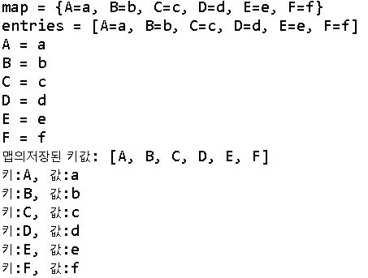

# 1. TreeMap
## 1.1 TreeMap이란

>Map은 Key-Value 형식의 데이터를 저장할 수 있는 자료구조이다.  
>중복을 허용하지 않으며 한개의 Key에 한개의 Value가 매칭된다.  
>Key는 중복 불가 , value는 중복 가능  
>특정 데이터를 찾을 때는 key를 이용해서 검색  

## 1.2 TreeMap의 특징
>검색성능은 HashMap이 더 뛰어나지만 HashMap에선 정렬 X  
>TreeMap은 키값을 정렬해주므로 키값을 순서대로 꺼낼대 유용하다.(오름차순)  

TreeMap 의 메서드

## 1.3 TreeMap 코드분석
java
<pre><code>
import java.util.Map;
import java.util.Set;
import java.util.TreeMap;

public class TreeMapEx {
	public static void main(String[] args) {
		TreeMapEx t = new TreeMapEx();
		t.checkTreeMap();
	}
	  public void checkTreeMap(){
	        TreeMap<String, String> map = new TreeMap<>();
	        map.put("C", "c"); 
	        map.put("B", "b");
	        map.put("A", "a");
	        map.put("D", "d");
	        map.put("F", "f");
	        map.put("E", "e");
	        //출력방법1
	        System.out.println("map = " + map);
	 	    Set<Map.Entry<String, String>> entries = map.entrySet();
	 	    System.out.println("entries = " + entries);  
	        
	 	    for(Map.Entry<String, String> tempEntry: entries){
	 		            System.out.println(tempEntry.getKey() +
	 		            		" = " + tempEntry.getValue());
	 		 }
 	        //출력방법2
	        System.out.println("맵의저장된 키값: "+map.keySet());
	        for(String key:map.keySet()) {
	        	System.out.println(String.format("키:%s, 값:%s", key,map.get(key)));
	        }	     
	    }
	}
</pre></code>

출력결과 

# 2. SortedMap
#### - Map를 상속받은 서브 인터페이스
#### - 잘 사용하지 않음

## 2.1 방식
### 1) 키 순으로 정렬
#### (1) java.util.TreeMap 사용하여 자동으로 키별로 정렬합니다.
- 코드
<pre><code>
import java.util.HashMap;
import java.util.Map;
import java.util.TreeMap;

public class SortByKeyExample1 {

    public static void main(String[] args) {

        Map<String, String> unsortMap = new HashMap<String, String>();
        unsortMap.put("Z", "z");
        unsortMap.put("B", "b");
        unsortMap.put("A", "a");
        unsortMap.put("C", "c");
        unsortMap.put("D", "d");
        unsortMap.put("E", "e");
        unsortMap.put("Y", "y");
        unsortMap.put("N", "n");
        unsortMap.put("J", "j");
        unsortMap.put("M", "m");
        unsortMap.put("F", "f");

        System.out.println("Unsort Map......");
        printMap(unsortMap);

        System.out.println("\nSorted Map......By Key");
        Map<String, String> treeMap = new TreeMap<String, String>(unsortMap);
        printMap(treeMap);

    }

    //pretty print a map
    public static <K, V> void printMap(Map<K, V> map) {
        for (Map.Entry<K, V> entry : map.entrySet()) {
            System.out.println("Key : " + entry.getKey() 
				+ " Value : " + entry.getValue());
        }
    }

}
</pre></code>

- 출력
<pre><code>
Unsort Map......
Key : A Value : a
Key : B Value : b
Key : C Value : c
Key : D Value : d
Key : E Value : e
Key : F Value : f
Key : Y Value : y
Key : Z Value : z
Key : J Value : j
Key : M Value : m
Key : N Value : n

Sorted Map......By Key
Key : A Value : a
Key : B Value : b
Key : C Value : c
Key : D Value : d
Key : E Value : e
Key : F Value : f
Key : J Value : j
Key : M Value : m
Key : N Value : n
Key : Y Value : y
Key : Z Value : z
</pre></code>

#### (2)java.util.TreeMap을 사용하여 내림차순으로 키를 정렬합니다.
- 코드
<pre><code>
import java.util.Comparator;
import java.util.HashMap;
import java.util.Map;
import java.util.TreeMap;

public class SortByKeyExample2 {

    public static void main(String[] args) {

        Map<Integer, String> unsortMap = new HashMap<Integer, String>();
        unsortMap.put(10, "z");
        unsortMap.put(5, "b");
        unsortMap.put(6, "a");
        unsortMap.put(20, "c");
        unsortMap.put(1, "d");
        unsortMap.put(7, "e");
        unsortMap.put(8, "y");
        unsortMap.put(99, "n");
        unsortMap.put(50, "j");
        unsortMap.put(2, "m");
        unsortMap.put(9, "f");

        System.out.println("Unsort Map......");
        printMap(unsortMap);

        System.out.println("\nSorted Map......By Key");
        Map<Integer, String> treeMap = new TreeMap<Integer, String>(
                new Comparator<Integer>() {

                    @Override
                    public int compare(Integer o1, Integer o2) {
                        return o2.compareTo(o1);
                    }

                });

	    /* For Java 8, try this lambda
		Map<Integer, String> treeMap = new TreeMap<>(
		                (Comparator<Integer>) (o1, o2) -> o2.compareTo(o1)
		        );
		*/
        treeMap.putAll(unsortMap);

        printMap(treeMap);

    }

    public static <K, V> void printMap(Map<K, V> map) {
        for (Map.Entry<K, V> entry : map.entrySet()) {
            System.out.println("Key : " + entry.getKey() 
				+ " Value : " + entry.getValue());
        }
    }

}
</pre></code>
- 출력
<pre><code>
Unsort Map......
Key : 1 Value : d
Key : 50 Value : j
Key : 2 Value : m
Key : 99 Value : n
Key : 20 Value : c
Key : 5 Value : b
Key : 6 Value : a
Key : 7 Value : e
Key : 8 Value : y
Key : 9 Value : f
Key : 10 Value : z

Sorted Map......By Key
Key : 99 Value : n
Key : 50 Value : j
Key : 20 Value : c
Key : 10 Value : z
Key : 9 Value : f
Key : 8 Value : y
Key : 7 Value : e
Key : 6 Value : a
Key : 5 Value : b
Key : 2 Value : m
Key : 1 Value : d
</pre></code>

### 2) 값 순으로 정렬
#### (1) Map을 List<Map>로 변환하고, 사용자정의 List<Map>을 정렬하여 LinkedHashMap에 넣는 방식이다.

<pre><code>
Map ---> List<Map> ---> Collections.sort() --> List<Map> (Sorted) ---> LinkedHashMap
</pre></code>

- 코드
<pre><code>
import java.util.*;

public class SortByValueExample1 {

    public static void main(String[] args) {

        Map<String, Integer> unsortMap = new HashMap<String, Integer>();
        unsortMap.put("z", 10);
        unsortMap.put("b", 5);
        unsortMap.put("a", 6);
        unsortMap.put("c", 20);
        unsortMap.put("d", 1);
        unsortMap.put("e", 7);
        unsortMap.put("y", 8);
        unsortMap.put("n", 99);
        unsortMap.put("j", 50);
        unsortMap.put("m", 2);
        unsortMap.put("f", 9);

        System.out.println("Unsort Map......");
        printMap(unsortMap);

        System.out.println("\nSorted Map......By Value");
        Map<String, Integer> sortedMap = sortByValue(unsortMap);
        printMap(sortedMap);

    }

    private static Map<String, Integer> sortByValue(Map<String, Integer> unsortMap) {

        // 1. Convert Map to List of Map
        List<Map.Entry<String, Integer>> list =
                new LinkedList<Map.Entry<String, Integer>>(unsortMap.entrySet());

        // 2. Sort list with Collections.sort(), provide a custom Comparator
        //    Try switch the o1 o2 position for a different order
        Collections.sort(list, new Comparator<Map.Entry<String, Integer>>() {
            public int compare(Map.Entry<String, Integer> o1,
                               Map.Entry<String, Integer> o2) {
                return (o1.getValue()).compareTo(o2.getValue());
            }
        });

        // 3. Loop the sorted list and put it into a new insertion order Map LinkedHashMap
        Map<String, Integer> sortedMap = new LinkedHashMap<String, Integer>();
        for (Map.Entry<String, Integer> entry : list) {
            sortedMap.put(entry.getKey(), entry.getValue());
        }

        /*
        //classic iterator example
        for (Iterator<Map.Entry<String, Integer>> it = list.iterator(); it.hasNext(); ) {
            Map.Entry<String, Integer> entry = it.next();
            sortedMap.put(entry.getKey(), entry.getValue());
        }*/

        return sortedMap;
    }

    public static <K, V> void printMap(Map<K, V> map) {
        for (Map.Entry<K, V> entry : map.entrySet()) {
            System.out.println("Key : " + entry.getKey()
                    + " Value : " + entry.getValue());
        }
    }

}
</pre></code>

- 출력
<pre><code>
Unsort Map......
Key : a Value : 6
Key : b Value : 5
Key : c Value : 20
Key : d Value : 1
Key : e Value : 7
Key : f Value : 9
Key : y Value : 8
Key : z Value : 10
Key : j Value : 50
Key : m Value : 2
Key : n Value : 99

Sorted Map......By Value
Key : d Value : 1
Key : m Value : 2
Key : b Value : 5
Key : a Value : 6
Key : e Value : 7
Key : y Value : 8
Key : f Value : 9
Key : z Value : 10
Key : c Value : 20
Key : j Value : 50
Key : n Value : 99
</pre></code>

#### (2) 위의 sortByValue() 코드에서 generics를 지원 하도록 수정한 코드
- 코드
<pre><code>
 public static <K, V extends Comparable<? super V>> Map<K, V> sortByValue(Map<K, V> unsortMap) {

        List<Map.Entry<K, V>> list =
                new LinkedList<Map.Entry<K, V>>(unsortMap.entrySet());

        Collections.sort(list, new Comparator<Map.Entry<K, V>>() {
            public int compare(Map.Entry<K, V> o1, Map.Entry<K, V> o2) {
                return (o1.getValue()).compareTo(o2.getValue());
            }
        });

        Map<K, V> result = new LinkedHashMap<K, V>();
        for (Map.Entry<K, V> entry : list) {
            result.put(entry.getKey(), entry.getValue());
        }

        return result;

    }
</pre></code>

###### 참고 문헌 : https://www.mkyong.com
