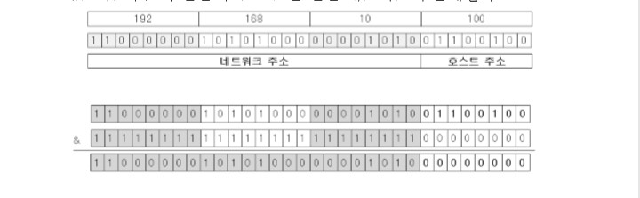
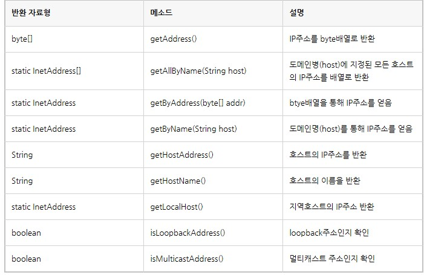

 네트워킹(NeWorking)
=======
네트워킹이란?

- 두대 이상의 컴퓨터를  연결하여 네트워크를 구성하는것
* 인터넷: 하나의 거대한 네트워크로 다양하고 방대한 데이터를 공유

1.1 클라이언트/서버(client/server)
-----
컴퓨터간의 관계를 구분하는 개념
- 서비스를 제공하는 쪽이 서버, 제공받는 쪽이 클라이언트
- 제공하는 서비스 종류에 따라 메일서버(email server),파일서버(file server),웹서버(web server)
- 서버가 서비스를 제공하기 위해서는 서버프로그램이 있어야 하고 클라이언트가 서비스를 제공받기 위해서는 서버프로그램과 연결할 수 있는 클라이언트 프로그램이 있어야한다.
- 예시: 웹서버에 접속하기 위한 웹브라우저(클라이언트 프로그램),
 다른 컴퓨터로부터 파일을 가져오는 동시에 제공하는 파일공유 프로그램(클라이언트 프로그램& 서버프로그램)

- 2가지 종류 존재: 서버기반 모델(server-based-model), P2P모델(peer-to-peer model)

- 서버 기반 모델: 네트워크를 구성할때 전용 서버를 두는 것
- P2p 모델: 별도의 전용서버 없이 각 클라이언트가 서버역활을 동시에 수행하는 것
 

1.2 IP주소(IP Address)
---
- 컴퓨터(호스트)를 구별하는데 사용되는 고유한 값으로 인터넷에 연결된 모든 컴퓨터는 IP주소를 갖는다.
- 4byte(32bit)의 정수로 구성(0~255사이 정수)
- 네트워크 주소와 호스트 주소로 나누어지는데, 각각 몇bit를 차지하는지는 네트워크를 어떻게 구성하였는지에 따라 다름

* 윈도우즈OS에서 호스트ip를 확인하려면 콘솔에서 ipconfig.exe를 실행하면 됨

- IP주소와 서브냇 마스크를 비트연산자 &로 연산하면 IP주소에서 네트워크 주소만 알아낼 수 있다.

1.3  InetAddress
---
- 자바에서는 IP주소를 다루기 위한 클래스로 InetAddress를 제공하며 다음과 같은 메소드에서 정보를 받아오는 형식으로 사용한다.

<pre>예시)

ip = InetAddress.getByName("www.daum.net");

 System.out.println("getHostName() :" + ip.getHostName());//호스트 이름 반환
 System.out.println("getHostAddress() :" + ip.getHostAddress());//호스트의 IP주소 반환

 byte[] ipAddr = ip.getAddress();//IP주소를 byte배열로 반환
 System.out.println("getAddress() :" + Arrays.toString(ipAddr));

 실행결과
 getHostName() :www.daum.net
 getHostAddress() :117.52.2.25
 getAddress() :[117, 52, 2, 25]

</pre>

1.4 URL (Uniform 
Resource Location)
---
- URL은 인터넷에 존재하는 여러 서버들이 제공하는 자원에 접근할 수 있는 주소를 표현하기 위한 것
- 형태: 프로토콜//호스트명:포트번호/경로명/파일명?쿼리스트링#참조
<pre>
프로토콜: 자원에 접근하기 위해 서버와 통신하는데 사용되는 통신규약
호스트명: 자원을 재공하는 서버의 이름
포트번호: 통신에 사용되는 서버의 포트번호
경로명: 접근하려는 자원이 저장된 서버상의 위치
파일명: 접근하려는 자원의 이름
쿼리:시용자가 입력한 데이터를 서버로 전달하는 부분
참조:  해당 웹 페이지의 특정 참조 지점으로 화면을 이동시키고자 할 때 사용
</pre>

예시)

