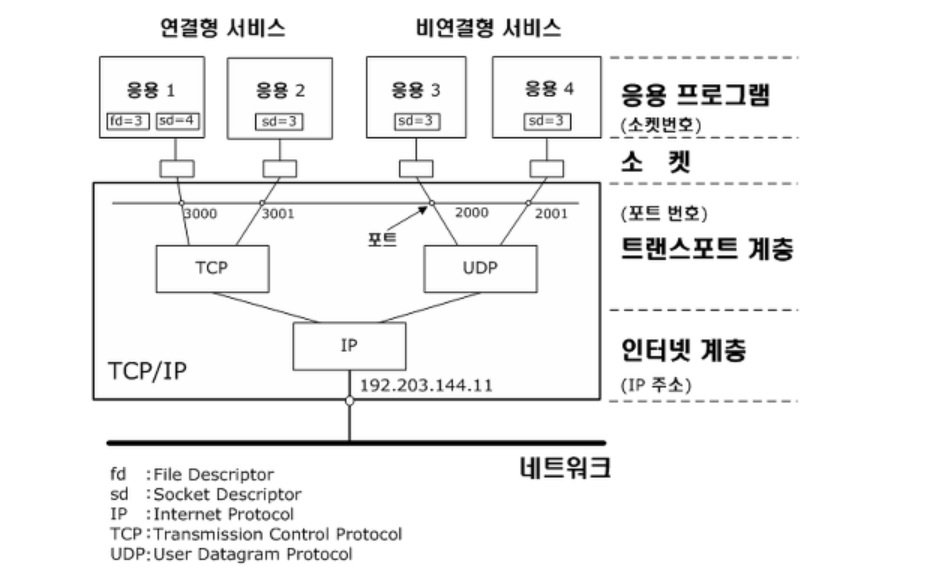
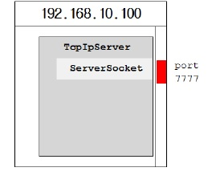

Socket
======
소켓이란?
--------
:컴퓨터 네트워크를 경유하는 프로세스 간 통신의 종착점

대부분의 네트워크 소켓=>인터넷 소켓
네트워크 통신을 위한 프로그램들은 소켓을 생성하고, 이 소켓을 통해서 서로 데이터 교환

<소켓의 구성요소>
<pre>
1.인터넷 프로토콜(TCP,UDP,raw IP)
2.로컬 IP주소
3.로컬 포트
4.원격 IP주소
5.원격 포트
</pre>
=>소켓을 구성하기 위해서는 위와 같이 5가지의 정보가 필요하며, 클라이언트-서버간 데이터 네트워킹을 위한 기본정보

TCP와UDP
-------

TCP/IP:이기종 시스템간의 통신을 위한 표준 프로토콜 -> 프로토콜의 집합

TCP와 UDP 둘다 TCP/IP프로토콜에 포함.

OSI 7계층의 전송계층에 해당하는 프로토콜

※프로토콜
: 컴퓨터사이나 중앙커퓨터와 단말기 사이에서 데이터 통신을 원활하게 하기 위해 필요한 통신규약.

※OSI 7계층
:국제 표준화기구에서 개발한 모델로, 컴퓨터 네트워크 프로토콜 디자인과 통신을 계층으로 나누어 설명한 것

**TCP**
-------
- 연결 기반 서비스, 1:1 연결
- 안정성과 순서를 보장. 서버측으로부터 패킷이 정상 도착했다는 신호를 받지 못하면 재전송
- 신뢰성있는 데이터 전송 
- 패킷을 자동으로 쪼개줌(송신 측 패킷 쪼갬, 수신 측 재조립)
- 회선이 처리할 수 있을 만큼의 적당한 속도로 보내줌
- 바이트 스트림 프로토콜로서, 데이터 경계를 구분하지 않음
- UDP보다 속도가 느림
- 파일을 주고받는데 적합
- 관련클래스: 소켓,서버소켓

*TCP소켓 프로그래밍*
-------------------

:클라이언트와 서버간의 일대일 통신

소켓
- 프로세스간의 통신담당, inputstream과 outputstream을 가지고있음.

서버소켓
- 새로운 소켓 생성해 상대편 소켓과 통신 할 수 있도록 연결
- 한포트에 하나의 서버소켓만 연결가능
  
실제적인 데이터통신은 서버소켓과 관계없이 소켓과 소켓간에 이루어짐

소켓들이 데이터를 주고받는 연결통로는 바로 입출력스트림

**<서버프로그램과 클라이언트 프로그램간의 연결과정>**

<pre>
1.서버프로그램 실행
> java.exe TcpIpServer

2.서버소켓을 생성
>serverSocket = new ServerSocket(7777);// TcpIpServer.java 

3. 서버소켓이 클라이언트 프로그램의 연결요청을 처리할 수 있도록 대기상태로 만든다. 
클라이언트 프로그램의
연결요청이 오면 새로운 소켓을 생성해서 클라이언트 프로그램의 소켓과 연결한다.
>Socket socket = serverSocket.accept();// TcpIpServer.java

4. 클라이언트 프로그램(TcpIpClient.java)에서 소켓을 생성하여 서버소켓에 연결을 요청한다.
>Socket socket = new Socket(“192.168.10.100”,7777); // TcpIpClient.java

5. 서버소켓은 클라이언트 프로그램의 연결요청을 받아 새로운 소켓을 생성하여 클라이언트의 소켓과 연결한다.
>Socket socket = serverSocket.accept(); // TcpIpServer.java

6. 새로 생성된 서버의 소켓(서버소켓 아님)은 클라이언트의 소켓과 통신한다.
</pre>

TCP flow
-------

socket()-타입 지정해 소켓 생성

bind()-사용할 주소와 포트지정

listen()-연결되지 않은 상태의 소켓을 Passive소켓으로 전환, 연결요청을 해당 소켓에 연결
최대 허용 연결개수를 지정하기도 함

connect()-TCP Client에서 서버와 연결하기 위해 사용,소켓과 목적지 주소 +포트 지정

accept()-connect()에서 받은 정보를 기준으로 접속 요청한 클라이언트와 연결하는 소켓 생성

close()-생성했던 소켓 종료

**UDP**
-------
- 비연결 기반, 1;1,1:n,n:n통신방식
- 신뢰성 없는 데이터전송
- 목적지에 데이터가 도착함을 보장하지 않고, 데이터를 잃거나 중복되거나 바뀔 수 있음
- 에러가 발생했거나,데이터가 유실 되었어도 자동으로 데이터를 재전송하지 않음
- IP의 역할과 유사하지만 IP계층에서 제공되지 않는 사용자 요청구분을 위한 포트번호와 데이터 손상여부확인을 위한 체크섬 기능 제공
- 목적지의 IP와 포트번호만 알면 누구든지 데이터를 보낼 수 있음
- 크기가 작고 실시간에 가까운 통신 필요시 사용
(스트리밍,FPS게임 등)
- TCP보다 전송속도가 빠름
- 관련클래스:데이터그램소켓, 데이터그램패킷, 멀티캐스트소켓

*UDP소켓 프로그래밍*
------------------
- 연결지향적인 프로토콜이 아니므로 서버소켓이 필요하지 않음
- 사용하는 소켓은 데이터그램 소켓이며 데이터를 데이터패킷에 담아서 전송

(데이터 패킷은 헤더와데이터로 구성되어있으며 헤더에는 데이터그램패킷을 수신할 호스트의 정보가 저장되어있음)

- 연결상태가 아니어도 되고 매번 전송에 따른 응답을 받을 필요가 없으므로 훨씬 간단한 구조를 가짐.

- 안전성은 부족할지라도 더 빠른 속도를 기대할 수 있음

UDP FLOW
--------
