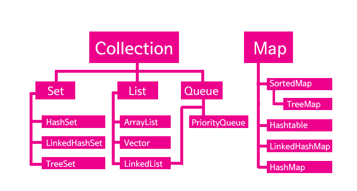

Sorted Map
===========

## 컬렉션 프레임 워크(Collection FrameWork)
 -> 일종의 컨테이너. 자바에서 필요한 객체를 저장하는 도구, 저장했다가 다시 꺼낼 쓸 수 있는 도구를 체계적으로 설계해 둔것.
 
 * 컬렉션 객체의 메소드를 형태적으로 동일하게 유지함으로써 사용법을 일관되게 만든 구조물
 * 인터페이스와 인터페이스를 구현한 실제 클래스로 분리

 * 컬렉션 프레임워크가 없다면 대부분의 일을 배열을 이용하는데 불편함이 많다. 
 
##### 자바의 컬렉션 프레임워크의 핵심이 되는 인터페이스들
 
 
 Collection: 단위 객체 하나씩 모아두는 것

 Map: 객체이 쌍(키,값)으로 구성된 것. 키는 Set으로, 값은 Collection으로 이루어짐.
/ 대표적인 Map- Hashtable, HashMap
 
 *Set은 중복이 없는 Collection

 SortedMap: Map의 확장으로 Map의 키부분을 lterator를 통해서  키 순서대로 정렬한 인터페이스
 /대표적인 Sorted Map: TreeMap

 Sorted Map
 ---------
* 형태:  SortedMap<key,value>
* 정렬된 맵의 Collection뷰를 탐색할 수 있는 lterator 인스턴스는 iterator()메소드를 통해 반환된다.
* Collection 뷰의 toArray()메소드로부터 반환되는 배열은 순서에 따라 키(key),값(Value) 또는 엔트리들을 포함한다.

### 참고) SortedMap과 관련된 여러 메소드들
1. Comparator <? super K> comparator()
- 현재 맵의 키정렬에 사용된 comparator를 반환한다. 만일 현재 맵이 키의 자연적인 순서를 정렬에 사용하면 null을 반환한다.

2. Set<<Map.Entry<K,V>>entry.set()
- 현재 맵에 포함되어 있는 맵핑을 Set형식의 뷰로 반환한다. 

3. K firstKey()
- 현재 맵에 있는 첫번째 키를 반환한다.(가장 작은 키) 반환할 키가 없을 시 NoSuchElementException 반환
4. SortedMap<K,V>headMap(K toKey)
- 현재맵에서 인자 ToKey보다 작은 키를 가진 엔트리들의 뷰를 반환한다, 반환된 뷰는 현재맵에 의존하기 꺠문에 반환된 뷰가 수정되면 현재 맵에도 반영되고 반대도 마찬가지이다.
5. Set<K>keySet()
- 현재맵에 포함되어 있는 키들을 Set형식의 뷰로 반환한다. 반환된 Set의 반복자는 올림차순으로 키를 반환한다. 이 또한 현재 맵에 의존한다.
6. K lastKey()
- 현재 맵에 있는 (가장 큰)마지막 키를 반환한다.
7. SortedMap<K,V>subMap(K fromKey,K toKey)
- 현재 맵에서 인자 fromKey(포함) 부터 toKey(미포함) 사이의 엔트리에 대한 뷰를 반환한다.
8. SortedMap<K,V>tailMap(K fromKey)
- 현재 맵에서 인자 fromKey보다 크거나 같은 키를 가진 엔트리들의 뷰를 반환한다.
9. Collection<V>values()
- 현재 맵에 포함되어있는 값들을 포함하는 Collection 형식의 뷰를 반환한다.

<pre>
 예시)
 import java.util.Iterator;
 import java.util.Map;
 import java.util.Set;
 import java.util.SortedMap;
 import java.util.TreeMap;
 public class SortedMapExample {
    public static void main(String[] args) {
        SortedMap<Integer,String> sm=new TreeMap<Integer, String>();
        sm.put(new Integer(2), "Two");
        sm.put(new Integer(1), "One");
        sm.put(new Integer(4), "Four");
        sm.put(new Integer(3), "Three");
        sm.put(new Integer(5), "Five");
        Set s=sm.entrySet();
        // Using iterator in SortedMap 
        Iterator i=s.iterator();
        while(i.hasNext())
        {
            Map.Entry m = (Map.Entry)i.next();
            int key = (Integer)m.getKey();
            String value=(String)m.getValue();
            System.out.println("Key :"+key+"  value :"+value);
        }
    }
}
    [Output]
    Key :1 value :One
    Key :2 value :Two
    Key :3 value :Three
    Key :4 value :Four
    Key :5 value :Five

    </pre> 

