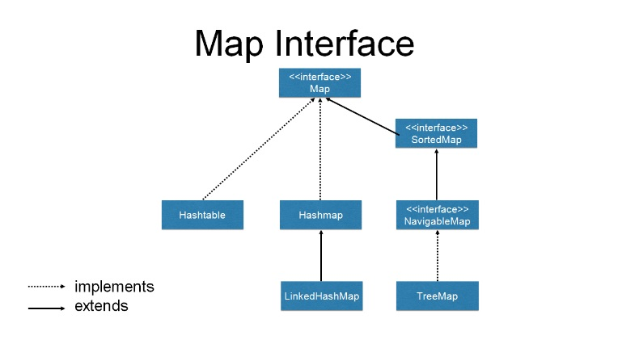
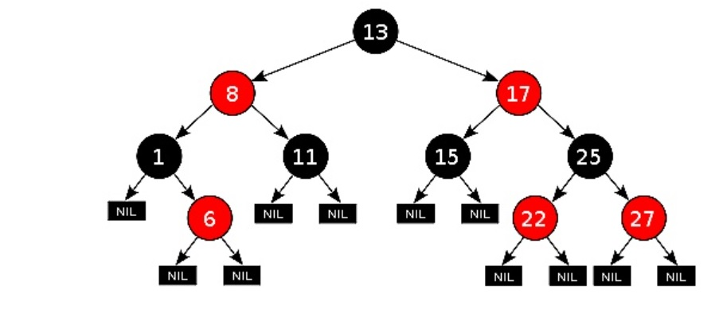
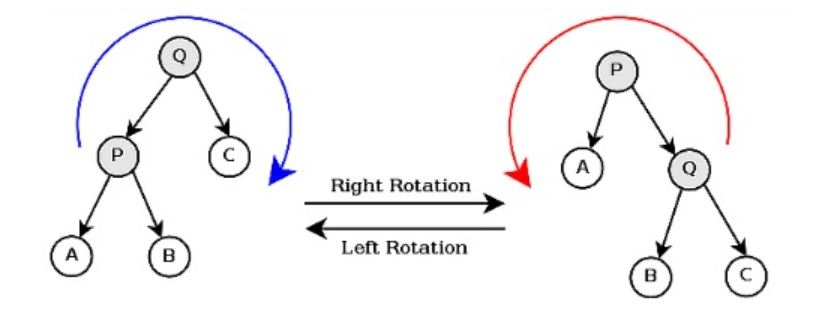
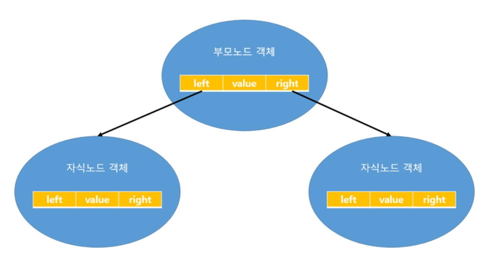
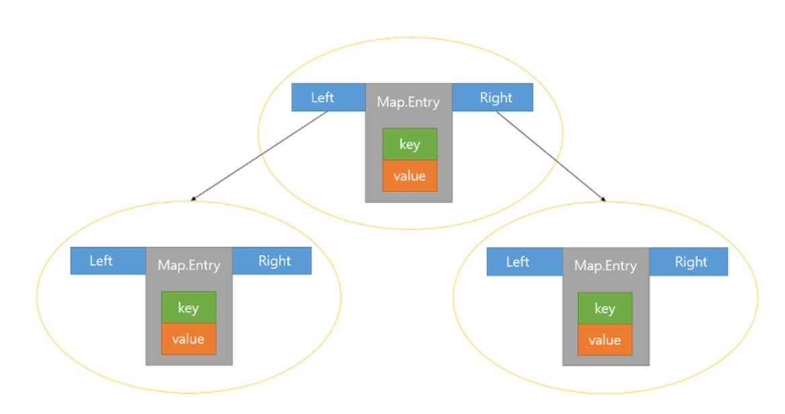

TreeMap
======

TreeMap이란?
-----------
- 이진검색트리의 형태로 키와 값의 쌍으로 이루어진 데이터 저장
- Map의 장점인 빠른 검색과 Tree의 장점인 정렬과  범위검색의 장점을 모두가짐
- 이진검색트리 처럼, 데이터를 저장할 때 정렬하기 때문에 저장시간이 길다는 단점을 가짐
- 정렬된 상태로 데이터를 조회하는 경우가 빈번하다면 데이터를 조회할 때 정렬해야하는 HashMap보다는 이미 정렬된 상태로 저장되어있는 TreeMap이 빠른 조회결과를 얻을 수 있음
- 주로 HashMap을 사용하고,정렬이나 범위 검색이 필요한 경우에만 TreeMap을 사용

*정렬 기준은 “숫자 > 알파벳 대문자 > 알파벳 소문자 > 한글"*

※이진검색트리 중 내부적으로 레드블랙트리를 이용

레드블랙트리
-----------
:정렬 알고리즘 중에서 일반적으로 가장 빠른 성능을 가진 알고리즘

조건
- 노드는 레드 혹은 블랙 중 하나의 색을 가짐
- 루트 노드는 반드시 블랙
- 모든 잎노드 또한 블랙
- 레드노드의 자식노드는 블랙노드, 블랙노드의 자식으로는 어떤색이 와도 상관 없음.
- 어떤 노드로부터 시작되서 잎 노드까지 도달하는 모든 경로에는 잎노드를 제외하면 같은 수의 블랙노드를 가진다.

조건 만족시,**루트노드로부터 가장 먼 경로까지의 거리가, 가장 가까운 경로까지의 거리의 두배보다 항상 작다는 가장 중요한 특성을 나타내게 됨**

회전
- 좌회전: 좌측에 있던 자식 노드를 부모 노드로 변경한 뒤, 왼쪽 자식노드의 오른쪽 자식노드를 부모의 왼쪽 자식으로 연결함
- 우회전: 우측에 있던 자식노드를 부모노드로 변경한 뒤, 오른쪽 자식노드의 왼쪽 자식노드를 부모의 오른쪽 자식으로 연결함

트리셋과 트리맵
-------------
**<트리셋>**

**<트리맵>**

=> 키와 값이 저장된 Map.Entry를 저장함, 값의 중복 허용

트리맵과 해쉬맵
--------------
트리맵은 해쉬맵과 마찬가지로 동기화 처리가 되어있지 않음.   

따라서 여러개의 스레드에서 동시에 접근할 때 이용
<pre>
SortedMap m=Collections.synchronizeMap(new TreeMap());
</pre>

그러나 트리맵은 랜덤접근이 
O(logn)성능을 지니므로 많은 데이터를 넣을 경우, 좋지 않은 성능이 나옴.
해쉬맵은 O(1)로 성능이 좋음

생성자
<pre>
TreeMap<String,Integer> map1=new TreeMap<String,Integer>();
</pre>
보통 제일 많이쓰는 경우 인데,
기본 생성자이면 객체 생성시 정렬을 갖는 빈 트리맵객체 생성한다는 뜻

여러 주요 메서드
--------------
<pre>
TreeMap()
:트리맵 객체 생성

TreeMap(Comparator c)
:지정된 Comparator을 기준으로 정렬하는 TreeMap객체를 생성함

TreeMap(Map m)
:주어진 맵에 저장된 모든 요소를 포함하는 트리맵 생성

TreeMap(SortedMap m)
:주어진 Sortedmap에 저장된 모든 요소를 포함하는 트리맵 생성

void clear()
:TreeMAp에 저장된 모든 객체 제거

Object clone()
:현재 TreeMap을 복제해서 반환

Compartor comparator()
:트리맵을 정렬기준이 되는 Comparator 반환
Comparator가 지정되지 않았다면 Null이 반환됨

boolean cotainsKey(Object Key)
:트리맵에 지정된 키가 포함되어있는지 알려줌

boolean containsValue(Object value)
:트리맵에 지정된 값이 포함되어있는지 알려줌

Set entrySet()
:트리맵에 저장된 키와 값을 엔트리(키와 값의 결합) 형태로 Set에 저장해서 반환

Object firstKey()
:트리맵에 저장된 첫번째 요소의 키를 반환

Object get(Object toKey)
:지정된 키와 값을 반환

SortedMap headMap(Object toKey)
:트리맵에 저장된 첫번째 요소부터 지정된 요소까지의 범위에 속한 모든 요소가 담긴 SortedMap을 반환(toKey는 포함되지 않음)

Set keySet()
:트리맵에 저장된 모든 키가 Set을 반환

boolean isEmpty()
:트리맵이 비어있는지 알려줌

Object lastKey()
:트리맵에 저장된 마지막 요소의 키를 반환함

void putAll(Map map)
:Map에 저장된 모든 요소를 트리맵에 저장

Object remove(Object key)
:트리맵에 지정된 키로 저장된 값을 제거

int size()
:트리맵에 저장된 요소의 개수 반환

SortedMap subMap(Object fromKey,Object toKey)
:지정된 두 개의 키사이에 있는 요소가 담긴 Sortedmap을 반환(to key는 포함되지 않음)

SortedMap failMap(Object fromKey)
:지정된 키부터 마지막 요소의 범위에 속한 요소가 담긴 SortedMap반환

Collection values()
:트리맵에 저장된 모든 값을 컬렉션 형태로 반환함
</pre>

예시
----
<pre>
 Map<String, String> map = Maps.newTreeMap();
 map.put("c", "1");
 map.put("a", "1");
 map.put("b", "1");
 map.put("k", "1");
 for (String s : map.keySet()) {
     System.out.println(s);
 }
 // a, b, c, k 출력
 </pre>

 <pre>
import java.util.Set;
import java.util.TreeMap;

public class MapExam
{
	//Key와 Value형태로 넣는 TreeMap선언
	TreeMap<Integer, String> map = new TreeMap<Integer, String>();
	
	public void addMap()
	{
		//임의의 값을 트리맵에 추가
		map.put(22, "서울");
		map.put(14, "부산");
		map.put(62, "대구");
		map.put(53, "광주");
		map.put(16, "전주");
	}
	
	public void printMap()
	{
		//트리맵의 키 테이블을 가져오기
		Set<Integer> set = map.keySet();
		
		//트리맵의 값을 출력
		for(Integer i : set)
			System.out.println(i + "번의 값 : " + map.get(i));
	}
	
	public static void main(String[] args)
	{
		MapExam mapExam = new MapExam();
		
		mapExam.addMap();
		mapExam.printMap();
	}
}

14번의 값:부산
16번의 값:전주
22번의 값:서울
53번의 값:광주
62번의 값:대구
</pre>

<pre>
import java.util.Map;
import java.util.Set;
import java.util.TreeMap;

public class TreeMapSample {
    public static void main(String[] ar){
        TreeMapSample ex = new TreeMapSample();
        ex.checkTreeMap();
    }

    public void checkTreeMap(){
        TreeMap<String, String> map = new TreeMap<String, String>();
        map.put("a", "A");
        map.put("b", "B");
        map.put("1", "one");
        map.put("2", "two");
        map.put("가", "ㄱ");
        map.put("나", "ㄴ");
        map.put("A", "a");
        map.put("B", "b");

        System.out.println("map = " + map);
//        map = {1=one, 2=two, A=a, B=b, a=A, b=B, 가=ㄱ, 나=ㄴ}
        Set<Map.Entry<String, String>> entries = map.entrySet();
        System.out.println("entries = " + entries);
//        entries = {1=one, 2=two, A=a, B=b, a=A, b=B, 가=ㄱ, 나=ㄴ}
        for(Map.Entry<String, String> tempEntry: entries){
            System.out.println(tempEntry.getKey() + " = " + tempEntry.getValue());
        }
//        1 = one
//        2 = two
//        A = a
//        B = b
//        a = A
//        b = B
//        가 = ㄱ
//        나 = ㄴ

        System.out.println("map.firstKey() = " + map.firstKey());
//        map.firstKey() = 1

        System.out.println("map.lastKey() = " + map.lastKey());
//        map.lastKey() = 나

        System.out.println("map.higherKey(\"A\") = " + map.higherKey("A"));
//        map.higherKey("A") = B

        System.out.println("map.lowerKey(\"A\") = " + map.lowerKey("A"));
//        map.lowerKey("A") = 2

    }
}
</pre>
