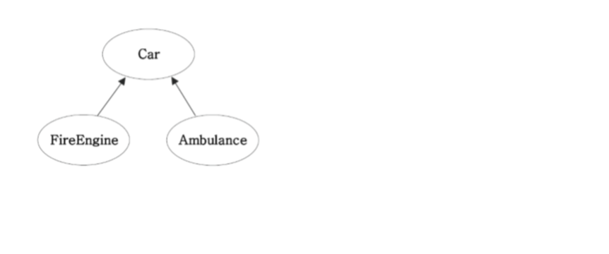

다형성(Polymorphism))
====================
다형성이란?
-------
* 여러가지 형태를 가질 수 있는 능력
* 조상클래스 타입의 참조변수로 자손클래스의 인스턴스를 참조할 수 있도록 하는것

#### *참조변수: c와 c++에서의 포인터와 비슷한 개념으로 인스턴스라는 덩어리의 주소라 할 수 있다.자바에는 클래스 변수만 존재하므로 *참조변수=클래스변수*라 할 수 있다*

*  조상타입의 참조변수로 자손타입의 인스턴스를 참조 O
*  자손타입의 참조변수로 조상타입의 인스턴스를 참조 X

<pre>

class Tv{
    void power(){}
    void channelup(){}
    void channeldown(){}

}

class CaptionTv extends Tv{// Tv를 상속받는 CaptionTv
    string text;
    void capion(){}

}
<pre>
예시 1.
CaptionTv c= new CaptionTv();
Tv t= new CaptionTv();

=>CaptionTv 인스턴스를 2개 생성하였지만 실제 인스턴스가 CaptionTv라 할지라도 참조변수 T로는 CaptionTv의 모든 멤버를 사용할 수 없다.
(t는 text와 caption()를 사용할 수 없다.)
</pre>

<pre>
예시 2.
CaptionTv c= new Tv(); //컴파일 에러

=>실제 인스턴스인 TV의 멤버 변수보다 참조변수 c가 사용할 수 있는 멤버 변수가 더 많아 컴파일 오류가 발생한다. 

</pre>
</pre>

# 참조변수의 형변환

* 서로 상속관계에 있는 클래스 사이에서만 참조변수도 형변환이 가능하다. 
* 자손타입의 참조변수를 조상타입으로 형변환하는 경우에는 형변환을 생략할 수 있다.
<pre>
  자손타입->조상타입(Up-casting): 형변환 생략 가능
  조상타입->자손타입(down-casting): 형변환 생략 불가능

</pre>

  <pre>
  class Car{
      void drive(){
          system.out.println("drive"); }
        void stop(){
            system.out.println("stop!!"); }
    }

class FireEngine extens Car {
        void water(){
            system.out.println("Water!"); }
    }

class Ambulance extends Car{
    void siren(){
            system.out.println("siren~!"); }
    }
</pre>

<pre>
예제.

public static void main(String args[]){
     Car car=null;
     FireEngine fe= new FireEngine();
     FireEngine fe2=null;

     fe.water();
     car=fe;//car= (Car)fe; 에서 형변환이 생략된 것
     //car.water();// 컴파일 에러
     fe2=(fireEngine)car;// 형변환을 생략할 수 없다.
     fe2.water();
 
}
=> [실행 결과]
    Water!
    Water!

</pre>

# instanceof 연산자
* 참조변수가 참조하는 인스턴스의 실제 타입을 체크하는데 사용
* 이항연산자이며 피연산자는 참조형 변수와 타입
* 연산결과는 true,false
* true이면 해당타입으로 형변환이 가능하다.
* 조상타입일떄도 결과는 true

<pre>
예제.
 void DoWork(Car c){
     if(c instanceof FireEngine){
         FireEngine fe= (FireEngine)c;
         fe.water();
     }
     else if(c instanceof Ambulance){
         Ambulance a-(Ambulance)c;
         a.siren();
     }
 }
</pre>

# 참조변수와 인스턴스의 연결
* 멤버변수가 조상클래스와 자손 클래스에 중복으로 정의된 경우, 조상타입의 참조변수를 사용했을 떄는 조상클래스에서 선언된 멤버변수가 사용되고, 자손타입의 참조변수를 사용했을 떄는 자손클래스에서 선언된 멤버변수가 사용된다.

* 메서드가 중복정의된 경우 *참조변수의 타입에 관계없이*  항상 실제 인스턴스의 타입에 정의된 메서드가 호출된다.

<pre>
예제.
class Parent{
    int x=100;
    void method(){
        system.out.println("Parent Method");
        }
 }
class Child extends Parent{
    int x=200;
    void method(){
    system.out.println("x="+x);//this.x와 같다
    system.out.println("super.x="+super.x);
    system.out.println("this.x="+this.x);
    }
}

public stsic void main(Sring[] args){
    Parent p=new Child();
    Child c=new Child();

    system.out.println("p.x="+p.x);
    p.method();
    system.out.println();
    system.out.println("c.x="+c.x);
    c.method();
}

=>[실행결과]
    p.x=100
    x=200
    super.x=100
    this.x=200

    c.x=200
    x=200
    super.x=100
    this.x=200

* super: 자손클래스에서 조상클래스로부터 상속받은 멤버를 참조할떄 사용하는 참조 변수

</pre>
# 매개변수의 다형성
* 참조형 매개변수는 메서드 호출 시, 자신과 같은 타입 또는 자손타입의 인스턴스를 넘겨줄 수 있다.

<pre>
예제.
class Product{
    int price;
    int bonusPont;
}

class Buyer{
    int monet=1000;
    int bonusPoint=0;

}
class Tv extends Product{}
class computer extends Product{}
class Audio extends Product{}

void buy(Product p){
    money-=p.price;
    bonusPoint +=p.bonusPoint;
}     

b.buy(tv);
b.buy(com);