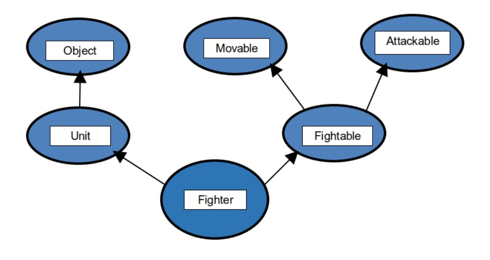
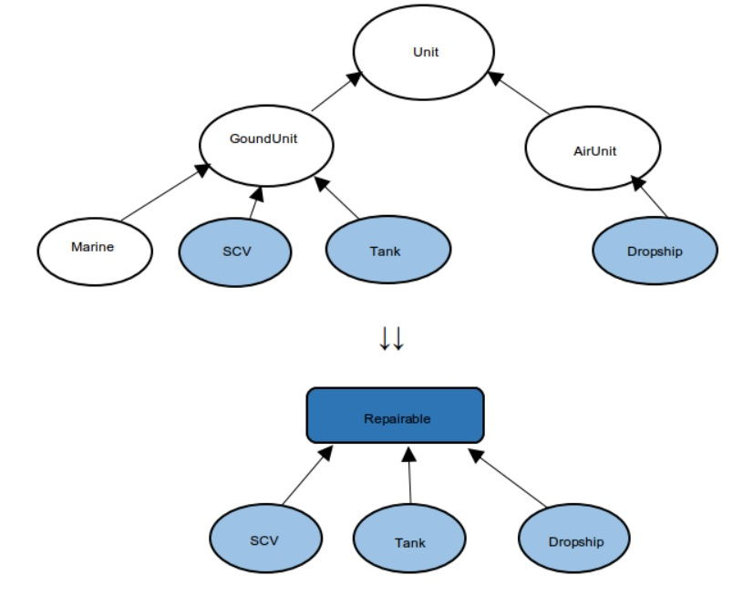

7.7 인터페이스
=============
인터페이스란?
------------
- 일종의 추상클래스로 실제 구현된 것이 전혀 없는 기본설계도.
- 추상클래스가 미완성 설계도(부분완성)라면
 - 인터페이스는 기본설계도(구현된것x,밑그림만)이다
- **추상매서드&상수만을 멤버로 가짐!!**

인터페이스 작성
-------------
class 대신 *interface* 사용
<pre>
interface 인터페이스이름
{
    public static final 타입 상수이름=값;
    public abstract 매서드이름(매개변수목록);
}
</pre>

<pre>
모든 멤버변수-public static final(생략가능)
모든 메서드-public abstract(생략가능)
</pre>

인터페이스 상속
-------------
- 인터페이스도 클래스처럼 상속가능(다중상속 허용)
<pre>
Interface Movable{}
Interface Attackable{}
Interface Fightable extends Movable,Attackable{}
</pre>
- 인터페이스는 Object클래스와 같은 최고 조상이 없다.
- 인터페이스는 인터페이스만 상속

인터페이스 구현
--------------
extends 대신 *implements*사용

<pre>
class 클래스이름 implements 인터페이스이름
{
     //인터페이스에 정의된 추상메서드 구현
}
</pre>

인터페이스에 정의된 추상매서드 완성!
<pre>
Abstract class Fighter implements Fightable{
	Public void move(int x,int y);
}
</pre>

상속과 구현동시 가능
<pre>
Class Fighter extends Unit implements Fightable{
	Public void move(int x,int y){}
	Public void attack(Unit u){}
}
</pre>

인터페이스를 이용한 다형성
------------------------

- 인터페이스 타입 변수로 인터페이스 구현한 클래스의 인스턴스 참조 가능

<pre>
class Fighter extends Unit implements Fightable{
    public void move(int x,int y){}
    public void attack(Fightable f){}
}
Fightable f=(Fightable)new Fighter();
           or
Fightable f= new Fighter();
</pre>

- 인터페이스를 메서드의 매개변수 타입으로 지정가능
<pre>
void attack(Fightable f){}
</pre>
- 인터페이스를 메서드의 리턴타입으로 지정가능
<pre>
Fightable method()
{
    return new Fighter();
}
</pre>

인터페이스의 장점
---------------
- 개발시간을 단축시킬 수 있음
- 표준화가 가능함
- **서로 관계없는 클래스들에게 관계를 맺어줄 수 있음**
-독립적인 프로그래밍이 가능

=>공통점이 없는 클래스들을 Repairable이라는 인터페이스를 사용해 기존의 상속체계를 유지하면서 이들 기계화 유닛에 공통점을 부여할 수 있음.

인터페이스의 이해
---------------
**클래스를 사용하는 쪽과 제공하는 쪽이 있다.**

**메서드를 사용하는 쪽에서는 사용하려는 메서드의 선언부만 알면된다.(내용은 몰라도 된다)**

<직접적인 관계>
<pre>
class A{
    public void methodA(B b)
    {
        b.methodB();
    }
}
class B{
    public void methodB{
        //메서드
    }
}
class InterfaceTest{
    public static void main(String args[])
    {
        A a=new A();
        a.methodA(new B());
    }
}
</pre>

※직접적인 관계의 두 클래스는 Provide가 변경되면 User도 변경되어야 한다는 단점
=>인터페이스를 통해 해결가능

<간접적인 관계>
<pre>
interface I{
    public abstract void methodB();
}

class B implements I
{
    public void methodB(){
        //메서드 구현
    }
}

class A{
    public void methodA(I i){
        i.methodB();
    }
}
</pre>

※User는 인터페이스하고만 직접적인 관계에 있기 때문에 
  provider의 변경에 영향을 받지 않는다.

 **오직 직접적인 관계에 있는 인터페이스의 영향만 받음.**
  
  여기서 인터페이스 I는 실제구현 내용을 감싸고 있는 껍데기이며,클래스 A는 껍데기 안에 어떤 알맹이가 들어 있는지 몰라도 됨.

